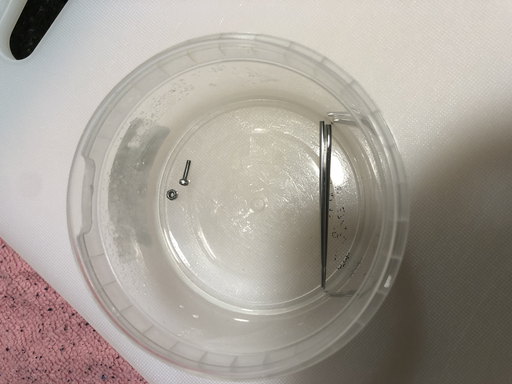
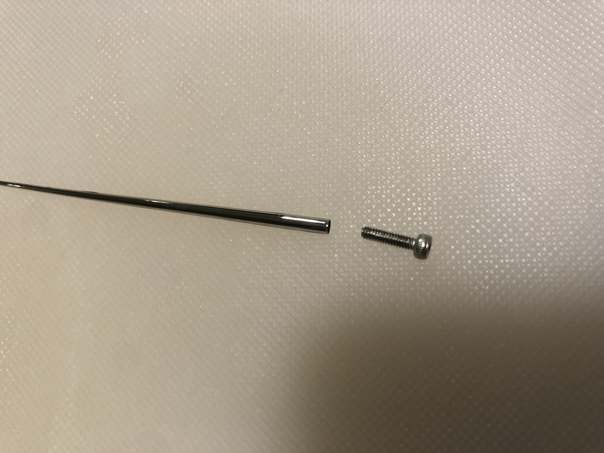
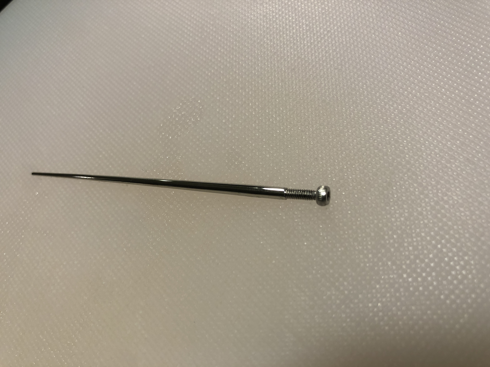
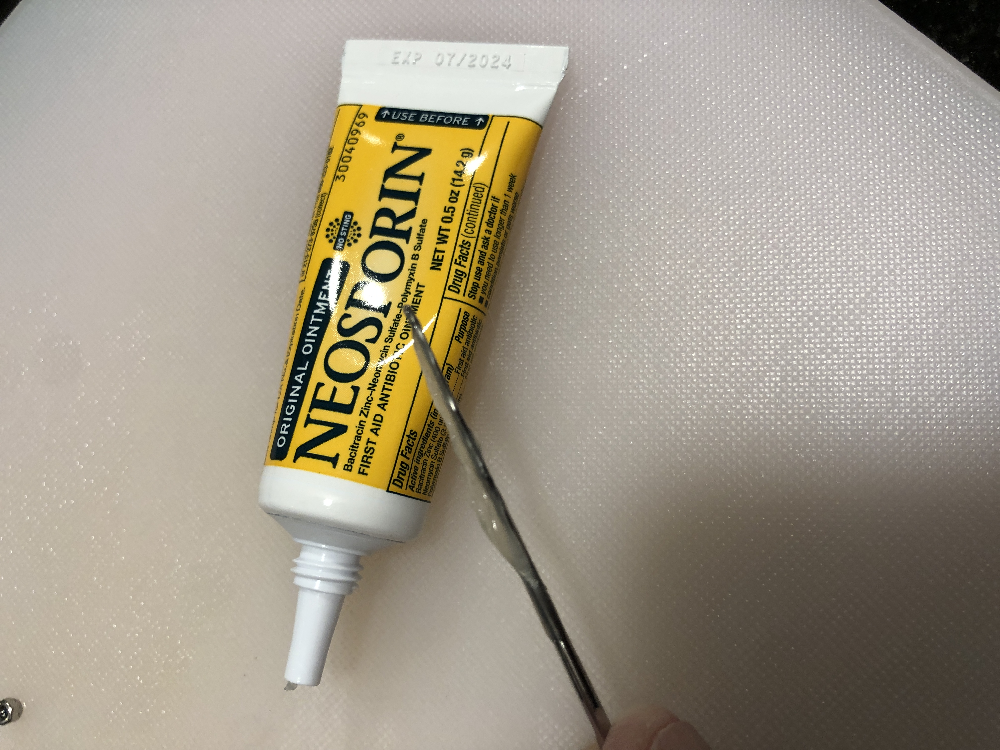

# hardwareJewellery
How to make jewellery out of nuts and bolts (and perhaps other hardware)

I'm often asked where I get my nuts and bolts earings. 

In the instructions below I assume
you already have a piercing and want to replace whatever jewellery you have
with a nut and bolt. I like socket head cap screws, but there are [many other
styles](https://manufast.in/a-comprehensive-guide-to-the-different-types-of-fasteners/). Not all are available in the small sizes needed for jewellery.

Decide what gauge you want. I started with 1.6 mm. It's hard to buy a
   single bolt so you'll end up with lots of spares which is good, they are
   tiny and easy to drop. Be sure to get stainless steel and that the pitch of
   the bolt matches the pitch of the nut (that's the 0.35mm after the
   length):

For the length, figure the thickness of your ear (or whatever you're piercing
is through) and add the thickness of the nut, plus a little bit extra. For my
ears 8 mm was perfect.

- [M1.6x8mmx0.35mm Stainless Steel Hex Socket Head Cap Screws 100 Pcs](https://www.amazon.com/gp/product/B00XP4ORF2/)
(diameter 1.6 mm, length 8mm, thread pitch 0.35mm)

- [300PCS Metric M1 M1.2 M1.4 M1.6 M2 M2.5 M3 M3.5 304 Stainless Steel Hex Nuts
Assortment Kit for Screws and
Bolts](https://www.amazon.com/gp/product/B0B7SLDHK1/)

If you want a bit larger try 2 mm:

- [562 Pieces M2 x 4/6 /8/10 /12/16 /20mm Hex Socket Head Cap Screws Nuts
  Washers Assortment Kit, 304 Stainless Steel, Fully Machine
  Thread](https://www.amazon.com/gp/product/B0B88RJ93J/)

The larger size has the advantage that you can get Nylon insert lock nuts which will hold
in place much better. This has a tiny Nylon insert which holds onto the bolt:

- [MroMax 100Pcs M2 x 0.4mm Nylon Insert Hex Lock Nuts 304 Stainless Steel Hex
  Self-Locking Nuts](https://www.amazon.com/MroMax-M2x0-4mm-Stainless-Silver-Self-Locking/dp/B07YV8SP7K/)

Get a hollow insertion tool that matches the gauge, some Neosporin, and alcohol

- [12G (2.0mm) hollow insertion tool](https://www.amazon.com/gp/product/B08MF9XMV1/)
- [Neosporin](https://www.amazon.com/gp/product/B00164IIUI/)
- [99% Isopropyl Alcohol](https://www.amazon.com/Amazon-Brand-Isopropyl-Antiseptic-Technical/dp/B07NFSFBXQ/)

Poor some alcohol into a small cup or bowl so that you can soak the insertion
tool and bolts and nuts. Let soak for awhile. Wash your hands. Use the alcohol
to clean the area around the piercing.

Carefully put the bolt in the hollow of the insertion tool:

Make sure the bolt is seated well in the insertion tool:

Put some Neosporin on the insertion tool to act as a lubricant:

Carefully holding the bolt in the insertion tool,
insert the tip of the insertion tool into the piercing,
and push it it from the bolt all the way through the piercing. 
The insertion tool will come out leaving the bolt in place.

Now comes the hard part: putting the nut on. 
Do this over a towel on your kitchen counter
or some other surface that doesn't bounce
and where you can see the nut if you drop it.

If you got the regular nut put it on as tight as you feel comfortable with.
Don't make it too tight or you will hurt your ear (or wherever the piercing
is).
This will work loose after awhile so you have to keep remembering to tighten
it every day. It will probably fall off at some point, so it's good that you
have many spares.

If you got the nylon lock nut it will stay in place but is much harder to
tighten. You can start the nut by hand, but then you will need tools in order
to tighten it:

- [1.5mm Allen wrench](https://www.amazon.com/Wera-05118066001-Screwdriver-Electronic-Applications/dp/B0001P18OQ/)
- [4mm nut driver](https://www.amazon.com/Wera-05118120001-Nutspinner-Electronics-Screwdriver/dp/B003ES5MLM/)

Once again, don't make it too tight. I did mine just until the bolt passed
through the nylon lock nut.
